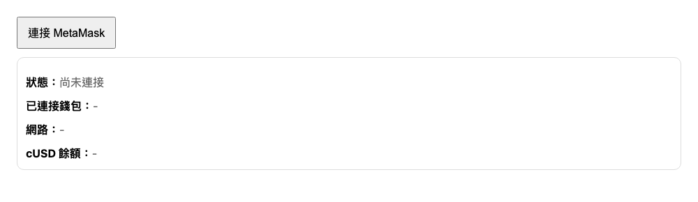

# Stablecoin Demo

一個極簡的穩定幣（Stablecoin）前端展示頁面，展示如何使用 `ethers.js v6` 與 MetaMask 錢包互動，並查詢特定 ERC-20 代幣（如 cUSD）的餘額。

單一 HTML 檔、134 行、無建置流程 —— 用瀏覽器打開就能跑。



## 📋 前置需求

- 安裝 [MetaMask](https://metamask.io/) 瀏覽器擴充功能
- 錢包已切換到部署了目標代幣合約的網路
- 不需要 Node.js、npm 或任何建置工具（`ethers.js` 走 CDN 的 UMD 版本）

## 🚀 快速開始

1. **開啟網頁**：直接在瀏覽器開啟 `stableCoin.html`。
2. **連接錢包**：點擊「連接 MetaMask」按鈕並在跳出的視窗中確認。
3. **查看資訊**：連接後，頁面會自動顯示您的錢包地址、目前網路資訊以及代幣餘額。

未連接時四個欄位都顯示 `–`（如上圖）；授權後才會填入實際數值。

## ⚙️ 設定

如果您想連結到自己的合約，請編輯 `stableCoin.html` 中的以下變數：

```javascript
// 你的 CompanyStablecoin 合約地址
const TOKEN_ADDRESS = "0xYourCompanyStablecoinAddressHere";
```

## 🛠️ 功能特點

- **ethers.js v6**：使用最新版本的 ethers 庫進行區塊鏈互動。
- **自動更新**：監聽 MetaMask 的 `accountsChanged` 與 `chainChanged` 事件，實現無刷新更新狀態。
- **極簡架構**：無需安裝 `npm` 或構建流程，適合快速展示與測試。

## 📖 更多文件

- [DECISIONS.md](DECISIONS.md) —— 架構決策與放棄過的方案
- [ROADMAP.md](ROADMAP.md) —— 後續規劃

## 🔗 相關專案

- **stablecoin-settlement**：負責鏈上智能合約（Solidity）與結算金庫邏輯的後端專案。

## 📄 License

MIT — 見 [LICENSE](LICENSE)。
